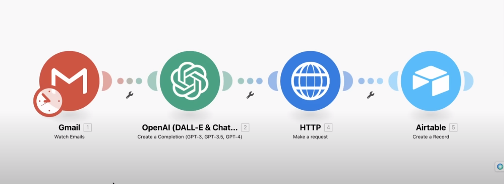

# 🧪 GPT_Researh_Agent
Make endless email easy, with GPT research agent to have a prioritized email list specifically designed for you 

*****
**🌍 Automation_Process **
1. Setup search tool
2. Setup Scraping tool #1
3. Setup Scraping tool #2 
4. Create agent
5. Setup GUI with streamlit
6. Research Agent 
7. Deploy
8. Integrate via make.com

*****



## 🌐 How to run?
### STEPS:

Clone the repository

```bash
https://github.com/AleemAhmedKhan/GPT_Researh_Agent.git
```
### 💽  STEP 01- Create a conda environment after opening the repository
    
```bash
conda create -n LLM python=3.8 -y
```

```bash
conda activate LLM
```


###  🔍 STEP 02- install the requirements
```bash
pip install -r requirements.txt
```


```bash
# Finally run the following command
python app.py
```

Now,
```bash
open up you local host and port
```


## 📡 CICD-Deployment-with-Github-Actions

## 🛠 Deployment Steps:

1. Build the Docker image of the Source Code
2. Push the Docker image to Container Registry
3. Launch the Web App Server in Azure 
4. Pull the Docker image from the container registry to Web App server and run 
